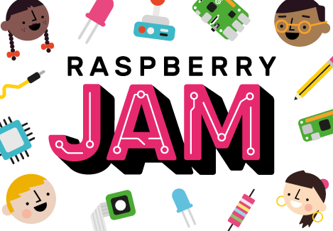

# Raspberry Jam branding pack

This is the Raspberry Jam branding pack, provided by the [Raspberry Pi Foundation](https://www.raspberrypi.org/) for people running [Raspberry Jams](https://www.raspberrypi.org/jam/) to use to promote their events.

Branding assets are provided in multiple formats, allowing use with Photoshop, GIMP, MS Word and more.

## Download

[Download the zip](http://rpf.io/jambrand)

## Contents

The pack contains:

- Eventbrite banners
    - Large images designed to fit the Eventbrite banner space (plain and templates)
- Fonts
    - The font files required for adding text to templates
- Graphics
    - Characters, objects and poster graphics from the Jam graphics set
- Jam maker badge
    - A graphic for the 'Jam maker' volunteer badge
- Jam sticker
    - The Raspberry Jam logo sticker graphic
- Letter templates
    - Raspberry Jam branded letter templates
- Logo
    - The Raspberry Jam logo graphic
- Logo templates
    - The Raspberry Jam logo graphic, with an editable location
- Poster templates
    - Templates for event posters/flyers
- Worksheets
    - PDF worksheets of activities ideal at Jams

## Issues

If you have any problems using the assets provided, please [open an issue](https://github.com/RaspberryPiFoundation/raspberry-jam-branding/issues) describing your problem, and we'll try to resolve the issue. Alternatively, please send an email to jam@raspberrypi.org.

## Licence and usage

These assets are provided under a [Creative Commons Zero licence](https://creativecommons.org/publicdomain/zero/1.0/).

Please follow the [branding guidelines](Raspberry-Jam-Brand-Guidelines.pdf) when using these assets.

## Last updated

Last updated 2017-11-23
